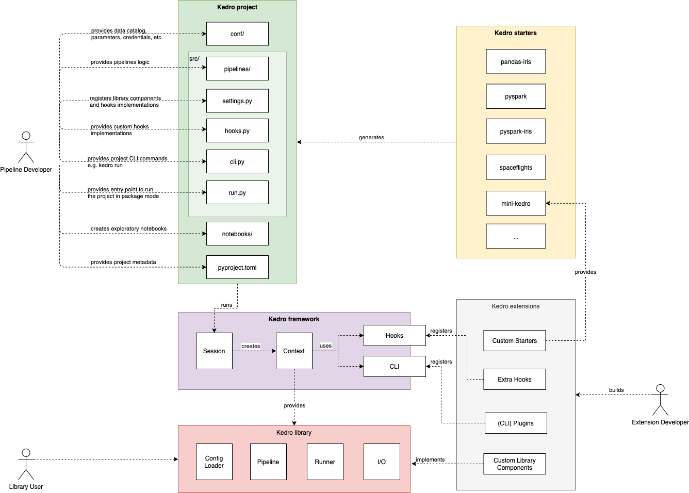

# Kedro architecture overview

> *Note:* This documentation is based on `Kedro 0.16.6`, if you spot anything that is incorrect then please create an [issue](https://github.com/quantumblacklabs/kedro/issues) or pull request.

Here is a diagram showing high-level architecture of Kedro library:

> *Note:* The arrow `A -> B` on the diagram above should be read as: _"A is aware of existence of B or directly uses B, while B does not necessarily know about A"_.

> *Note:* Internally we use [import-linter](https://github.com/seddonym/import-linter/) to enforce this structure and generally want the lower layer to be unaware of the above layers.

## Building blocks

The architecture diagram above is formed of the following building blocks:

### Project

This section contains the building blocks that help accessing core components of the Kedro project (e.g., the data catalog or the pipeline).

#### `cli.py`

A Python file that contains project specific CLI commands (e.g., `kedro run`, `kedro test`, etc.). This file must be located at the root of the project.

#### `run.py`

A Python file located in `src/<python_package>/run.py`, which by default contains the definition of `ProjectContext`, a concrete implementation of `KedroContext` class. This file also serves as the main entry point of the project.

#### `.kedro.yml`

`.kedro.yml` identifies the project root, which is used by other Kedro components and contains the following configuration entries:
- `source_dir`: (Optional) The directory of the source path relative to the project root path. Default directory is `src/` and when customised the path should be separated by a forward slash (e.g `src/<path_to_src>/`)
- `context_path`: A top-level key pointing to the absolute path of the context class implementation (default is `<python_project>.run.ProjectContext`)
- `hooks`: (Optional) A list of paths pointing to [Hooks](../07_extend_kedro/02_hooks.md) implementations to be registered with the project (default is `<python_project>.hooks.project_hooks`)

`.kedro.yml` must be located at the root of the project.

> *Note:* Since Kedro 0.16.6, the `.kedro.yml` file is optional, instead a `pyproject.toml` file can be used with the same content under `[tool.kedro]` section.

#### `00-kedro-init.py`

This script is automatically invoked at IPython kernel startup when calling `kedro jupyter notebook`, `kedro jupyter lab` and `kedro ipython` CLI commands. `00-kedro-init.py` creates an instance of `ProjectContext` object, which can be used to interact with the current project right away.

#### `ProjectContext`

Project specific context class that extends `kedro.framework.context.KedroContext` abstract class. `ProjectContext` contains the information about the current project name, Kedro version used to generate the project, and concrete pipeline definition.

### Framework

This section contains the building blocks that help running native Kedro and plugin CLI commands.

#### `kedro cli`

Any Kedro CLI command (e.g., `kedro new`, `kedro run`) executed by a user.

#### `kedro/cli/cli.py`

A Python file that contains Kedro global CLI commands, i.e. the ones that do not require a Kedro project in the current working directory to work (e.g., `kedro new`, `kedro info`).

#### `plugins`

Any CLI command that is implemented by a [Kedro plugin](../07_extend_kedro/04_plugins.md) (e.g., [Kedro-Docker](https://github.com/quantumblacklabs/kedro-docker), [Kedro-Airflow](https://github.com/quantumblacklabs/kedro-airflow), [Kedro-Viz](https://github.com/quantumblacklabs/kedro-viz)).

#### `get_project_context()`

A python function that instantiates the project context by calling `load_context()`. `get_project_context()` also preserves backwards compatible interface to ensure old versions of the plugins continue working even if breaking changes are introduced in `load_context()`.

> *Note:* This function is intended for plugin use only and will remain backwards compatible. To instantiate the project context outside of a plugin, we strongly recommend to directly call `load_context()`.

#### `load_context()`

A python function that locates Kedro project based on `.kedro.yml` or `pyproject.toml` (if `.kedro.yml` doesn't exist) and instantiates the project context.

#### `KedroContext`

The base class for project context implementations. It holds the configuration and Kedro's main functionality, and also serves the purpose of the main entry point for interactions with the core project components.

### Library

This section lists core Kedro components. These library components can be used both in conjunction and separately.

#### `ConfigLoader`

Helper class that enables loading the project configuration in a consistent way.

#### `Pipeline`

A collection of `Node` objects with the preserved execution order.

#### `AbstractRunner`

A base class for all `Pipeline` runner implementations.

#### `DataCatalog`

A dataset store providing `load` and `save` capabilities for the underlying datasets.

#### `AbstractDataSet`

A base class for all dataset implementations.
